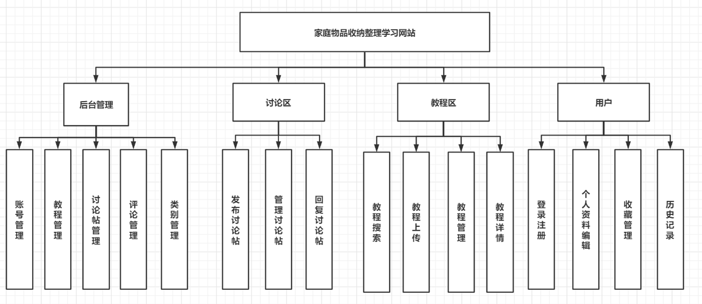
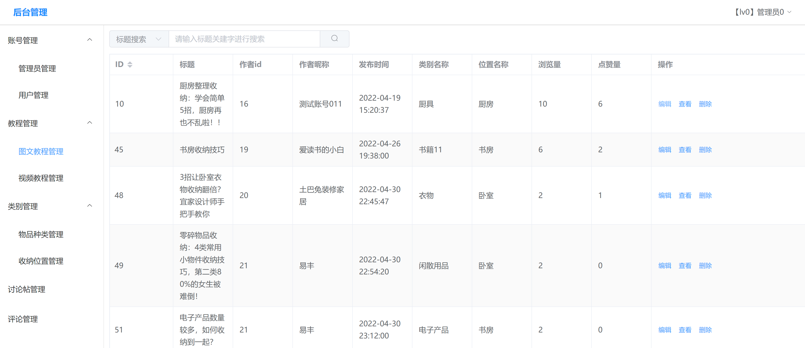

# 家庭物品整理收纳学习网站

## 项目说明
家庭物品整理收纳学习网站（前台、后台）
前端：Vue ElementPlus  西瓜播放器 wangEditor  
后端: Springboot MybatisPlus Hutool  
数据库: MySQl






# Springboot+Vue环境搭建

- [参考视频](https://www.bilibili.com/video/BV14y4y1M7Nc?from=search&seid=1396562774652526169&spm_id_from=333.337.0.0)

- 安装vue环境
  [Vue.js (vuejs.org)](https://cn.vuejs.org/)
  在cmd中输入命令 `npm -install -g @vue/cli`

- 创建项目
  在项目文件夹路径使用cmd，命令 `vue create project-name`

- [ElementPlus官网](https://element-plus.gitee.io/zh-CN/guide/installation.html)（Vue组件库）
  cmd输入命令`npm install element-plus --save`


- spring 环境搭建
  [Spring Initializr](https://start.spring.io/)
  

- 安装Mybaits-Plus
  [安装 | MyBatis-Plus (baomidou.com)](https://baomidou.com/pages/bab2db/#snapshot)
  在pom.xml中增加依赖：
```xml
<dependency>
    <groupId>com.baomidou</groupId>
    <artifactId>mybatis-plus-boot-starter</artifactId>
    <version>3.4.3.1</version>
</dependency>
```

添加完后点击IDEA右上角小图标可开始下载

# 数据库配置


## mysql安装
[下载和安装MySQL(傻瓜)教程_全 洛的博客-CSDN博客_mysql下载安装教程](https://blog.csdn.net/weixin_43347550/article/details/105654351?ops_request_misc=%257B%2522request%255Fid%2522%253A%2522164854911616782092982903%2522%252C%2522scm%2522%253A%252220140713.130102334..%2522%257D&request_id=164854911616782092982903&biz_id=0&utm_medium=distribute.pc_search_result.none-task-blog-2~all~top_click~default-3-105654351.142^v5^pc_search_insert_es_download,143^v6^control&utm_term=%EF%BD%8Dysql%E4%B8%8B%E8%BD%BD&spm=1018.2226.3001.4187)

```console
C:\Program Files\MySQL\MySQL Server 8.0\bin>mysql -u root -p
Enter password: ******
Welcome to the MySQL monitor.  Commands end with ; or \g.
Your MySQL connection id is 11
Server version: 8.0.28 MySQL Community Server - GPL

Copyright (c) 2000, 2022, Oracle and/or its affiliates.

Oracle is a registered trademark of Oracle Corporation and/or its
affiliates. Other names may be trademarks of their respective
owners.

Type 'help;' or '\h' for help. Type '\c' to clear the current input statement.
```


## mysql卸载
（1）控制面板，卸载MySQL。这样并没有卸载干净

（2）找到之前安装MySQL的路径，删除MySQL文件夹。比如：我的安装路径在C盘 ，C盘–> Program Files–> MySQL --> 删掉MySQL文件夹（因为文件夹中还有残留文件）

（3）打开C盘 --> 找到programDate（这个是隐藏文件）–> MySQL --> 删掉MySQL文件夹（因为这个文件夹中还有数据残留）

（4）清理注册表（一般不需要，除非安装的时候出问题）
先进入注册表：win+R --> 输入regedit，根据下面给出的路径，在注册表中找到MySQL目录进行删除

        HKEY_LOCAL_MACHINE\SYSTEM\ControlSet001\Services\EventLog\Application\MySQL目录
        HKEY_LOCAL_MACHINE\SYSTEM\ControlSet002\Services\EventLog\Application\MySQL目录
        HKEY_LOCAL_MACHINE\SYSTEM\CurrentControlSet\Services\EventLog\Application\MySQL目录
        HKEY_LOCAL_MACHINE\SYSTEM\CurrentControl001\Services\MySQL目录
        HKEY_LOCAL_MACHINE\SYSTEM\CurrentControl002\Services\MySQL目录
        HKEY_LOCAL_MACHINE\SYSTEM\CurrentControlSet\Services\MySQL目录
